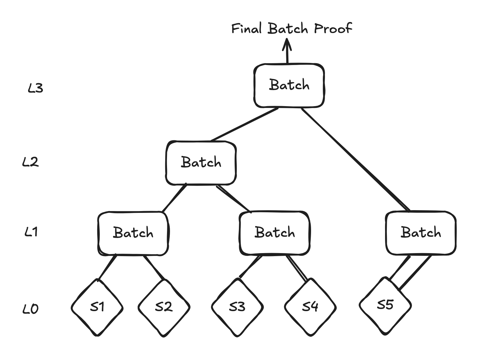
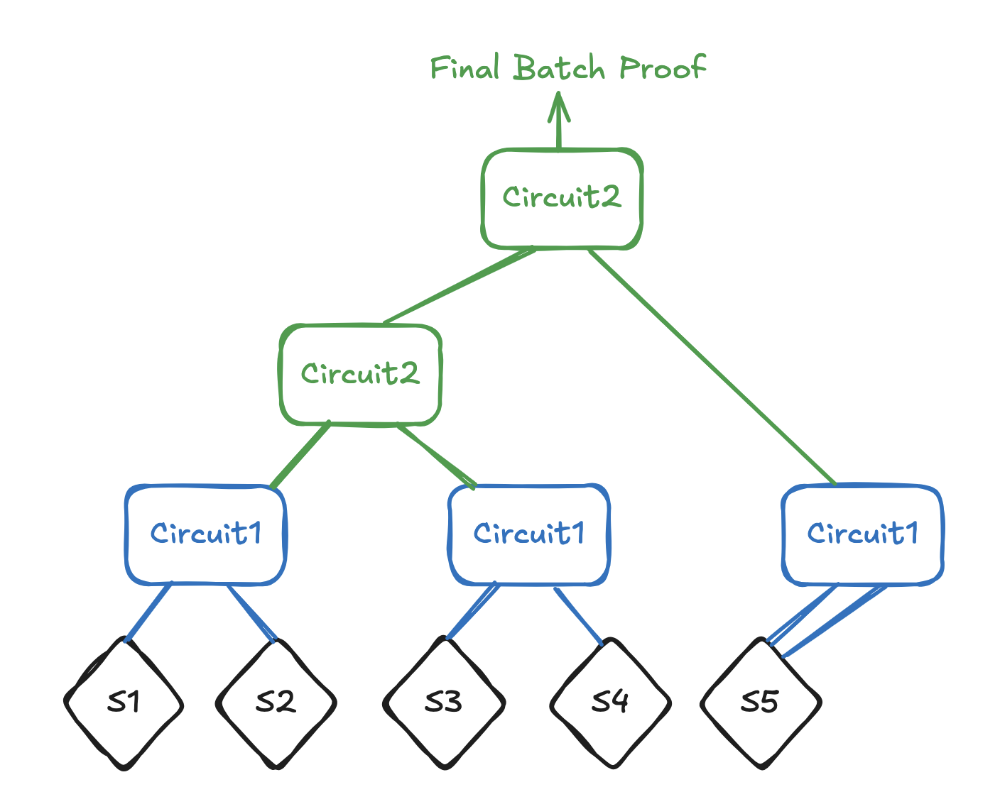

# Batching Noir Semaphore proofs

In an effort to lower on-chain verification costs, we added an additional feature for Semaphore in Noir: batching of Semaphore Noir proofs. We achieved this by using [recursive proofs](https://noir-lang.org/docs/dev/explainers/explainer-recursion/) in Noir. In this section we'll briefly explain how it works and how to use it.

**[Draft report] Note:** the first implementation we made of this assumed a trusted backend that would generate the batch proof and gather the nullifiers and merkle roots. We are now working on an improved version where there is no need for a trusted backend and the nullifiers & merkle roots are propagated in the batching circuits during the batching process. The report already reflects this new functionality, the code is WIP. The links to the code & benchmarks will be updated when the code is ready. 

## Batching the Semaphore proofs
To achieve batching we use Noir circuits that verify 2 previously generated proofs, by using the `verify_proof` functionality:
```rust=
use dep::std::verify_proof;

verify_proof(
        verification_key,
        proof,
        public_inputs,
        key_hash,
    );
```
From each pair of Semaphore proofs, we generate a single "Batch proof", which then can be used to be paired up again with other Batch proofs. Doing this repeatedly leads us to a final "root" Batch proof. To account for the fact that our number of Semaphore proofs and intermediate nodes might not form a perfect binary tree with this strategy we handle this as follows:
1. If there are an odd number of Semaphore proofs, duplicate the last Semaphore proof
2. In the next layers if there is a node without sibling, promote it to the next level. This is how it works in [LeanIMT](https://zkkit.pse.dev/classes/_zk_kit_lean_imt.LeanIMT.html) as well, which is the optimized binary tree structure used in Semaphore. 

For example, with 5 Semaphore proofs it would work as depicted in the image below: Semaphore proof 5 gets duplicated for self-pairing, and the third Batch proof on L1 gets promoted to L2 for pairing. 

<p align="center">
  
</p>

But there is a catch; we can't use the same Batch circuit for all the layers. This is because of the difference in number of public inputs; a Semaphore proof has 4 public inputs, while a Batch proof has 0. This is why we created 2 slightly different batching circuits:
- [Circuit1](https://github.com/hashcloak/semaphore-noir/blob/noir-support-part2/packages/noir-proof-batch/circuits/batch_2_leaves/src/main.nr): Batch 2 Semaphore Proofs 
- [Circuit2](https://github.com/hashcloak/semaphore-noir/blob/noir-support-part2/packages/noir-proof-batch/circuits/batch_2_nodes/src/main.nr): Batch 2 Recursive Proofs

This also explains why a Semaphore proof aren't promoted to the next level if there are an odd number of leaves; it doesn't directly fit the input type for Circuit2. As a solution we chose to self-pair the last leaf, so we start batching after layer 1 with a homogeneous proof type. (Of course, another approach could be to create an additional Batch circuit that takes a Semaphore proof and a Batch proof, but we opted for the least amount of circuits for now.) This full strategy is shown below. 

<p align="center">
  
</p>

A detail of the implementation is that the final Batch proof can be generated with the `keccak` flag, which makes it ready for on-chain verification. 

## Propagation of nullifiers and merkle roots

In the standard "single" Semaphore Noir setting the `validateProof` function in the smart contract checks a couple of things:
1. The zero knowledge proof that was sent is valid
2. The nullifier hasn't been used before
3. The merkle root used in the proofs is valid (it's either the current merkle root of the group or a previous one)

Lifting this to the batch setting, we still need to take care of the nullifiers and merkle roots that belong to the initial Semaphore proofs. If we only do proof verification in a recursive circuit, there is no public input or output, which means the final batch proof has no public inputs. The validity of the batch proof itself could be verified, but in the context of Semaphore this won't guarantee the validity of the nullifiers and merkle proofs used in the batch. 

This problem can be solved by propagating these values up the tree that we use for batching (as explained above). In this way, the initial input values will still be tied to the final batch proof. Then, it can be checked in the smart contract that the nullifiers and merkle roots are valid and that those were indeed the values used in the batched Semaphore proofs. 

In practice, we propagate a hash of the nullifiers and merkle roots for each pair of Semaphore proofs, and apply consequent hashing in the next layers of the batching tree. Specifically it works like this (psuedocode snippets):
1. Leaf layer: 
```rust=
hash(
  sem_proof1.nullifier, 
  sem_proof1.merkle_root, 
  sem_proof2.nullifier, 
  sem_proof2.merkle_root
)
```
3. Node layers: 
```rust=
hash(
  batch_proof1.inputs_hash, 
  batch_proof2.inputs_hash
)
```

Now, the final batch proof outputs the final hash. This hash is recomputed in the smart contract and used to verify the batch proof. Note that we use `keccak` for hashing, because this will be cheaper in the smart contract. 

## Usage details & tutorial

To implement batching we use bb CLI; at the moment it's not possible to use `bb.js` because the amount of recursion we use leads to memory errors. The upside of this is that bb CLI is faster than using `bb.js`, the downside is that batching can only be supported by `node` and not for browsers. 

Furthermore, the Semaphore proofs that are used for batching must be generated with a special flag. This can be done with the special function [`generateNoirProofForBatching`](https://github.com/hashcloak/semaphore-noir/blob/noir-support-part2/packages/noir-proof-batch/src/generate-proof-noir.ts#L73). 

A full tutorial on how to use batching in a project can be found [here](https://hackmd.io/m6z6nF3FRo6InRlffHmDYQ).

