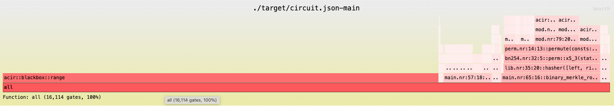
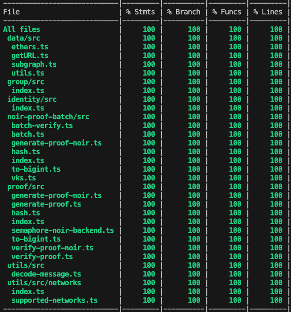

# Semaphore in Noir

To learn more about how the Semaphore protocol works we refer to the [official docs](https://docs.semaphore.pse.dev/). In this section we'll share how the Semaphore Noir implementation was done. 

## Noir circuit
We implemented the Semaphore circuit in Noir. It allows users to prove their group membership without revealing their identities using zero-knowledge proofs. 
    
The witness of the Noir circuit includes the prover's secret key and fields for the Merkle proof. It also takes the scope, a message, the Merkle root, and the nullifier as public inputs. First, the circuit generates the prover's Semaphore identity with the secret key. Then it verifies that the identity is part of the Merkle tree by calculating the Merkle root using the Merkle proof. Afterward, it calculates the nullifier by hashing the scope and prover's secret key. The nullifier can be used to prevent a same proof from being used twice. Finally, the circuit outputs the Merkle tree root and the nullifier that the verifier can check.
    
Semaphore circuit requires a global value `MAX_DEPTH` to set the maximum depth of the Merkle tree. The smaller the depth is, the more efficient a circuit will be. However, a Merkle tree can only hold up to $2^{(MAX\_DEPTH)}$ members. To allow users to have the best efficiency for every use case, we provide 32 precompiled circuit for `MAX_DEPTH` from 1 to 32. Users can use the Semaphore SDK to choose the desired precompile as we will explain in the next section.
    
Below is the flamegraph for the Semaphore Noir circuit for `MAX_DEPTH`10. This graph indicates how many gates each piece of functionality contributes to the total circuitsize. In this case, `acir::blackbox::range` accounts for the majority of the gates, due to the [fixed setup costs](https://noir-lang.org/docs/tooling/profiler#understanding-bottlenecks) of lookup tables in Barretenberg UltraHonk.

### Trusted Setup Considerations

A key advantage of using Noir with UltraHonk compared to Circom with Groth16 is that no trusted setup ceremony is needed for each circuit. In the original Semaphore implementation a separate trusted setup is required for all supported tree depths, since each depth results in a distinct circuit. Because Semaphore supports tree depths 1-32, this results in 32 trusted setup ceremonies. Furthermore, any change to the circuits requires a new trusted setup ceremony. 

With Semaphore Noir this overhead is eliminated. The backend used in this project, Barretenberg's UltraHonk, relies on a universal trusted setup and can thus support all tree depths (circuits) without additional ceremonies. 

## Semaphore SDK
The Semaphore SDK allows users to easily create and interact with a Semaphore group as well as generate and verify proofs. We added several key components such as the [proof package](https://github.com/hashcloak/semaphore-noir/tree/noir-support-part2/packages/proof), so it now supports Noir proofs.
    
As mentioned in the last section, to improve efficiency, we precompiled the circuits for `MAX_DEPTH` from 1 to 32. We also saved the verification keys with respect to each circuit, so users won't have to regenerate the keys every time. The precompiled circuits and verification keys can be found [here](https://github.com/hashcloak/noir-artifacts-host). The library for downloading and managing circuits and keys can be found [here](https://github.com/hashcloak/snark-artifacts/tree/semaphore-noir). Users can also provide their own compiled circuits to the SDK instead of using the precompiled one. Note that in order to use the stored verification keys for efficiency, we made some slight modifications to the [UltraHonkBackend](https://github.com/hashcloak/semaphore-noir/blob/noir-support-part2/packages/proof/src/ultrahonk.ts) in the [bb.js](https://github.com/AztecProtocol/aztec-packages/tree/master/barretenberg/ts).

To further reduce proving and verification time, we separate the initialization of a [proving backend](https://github.com/hashcloak/semaphore-noir/blob/noir-support-part2/packages/proof/src/semaphore-noir-backend.ts) with the actual proving step. A proving backend is tied to a Noir circuit with a fixed `MAX_DEPTH` as mentioned above. By doing so, we can reuse the proving backend as long as the `MAX_DEPTH` of the backend can generate a Merkle tree big enough to hold all the members of the group we are proving or verifying.
    
Below is the test coverage for the updated Semaphore SDK.

## Semaphore Solidity Contracts
We created a new version of the [Semaphore Solidity contracts](https://github.com/hashcloak/semaphore-noir/tree/noir-support-part2/packages/contracts-noir) that support Noir proofs. The [main contract](https://github.com/hashcloak/semaphore-noir/blob/noir-support-part2/packages/contracts-noir/contracts/SemaphoreNoir.sol) lets users create and maintain on-chain Semaphore groups. It also allows users to verify zero-knowledge proofs generated by the Semaphore SDK. In order to verify the proofs, we store the 32 verification keys as mentioned above in two contracts [(1)](https://github.com/hashcloak/semaphore-noir/blob/noir-support-part2/packages/contracts-noir/contracts/base/SemaphoreNoirVerifierKeyPts1.sol) [(2)](https://github.com/hashcloak/semaphore-noir/blob/noir-support-part2/packages/contracts-noir/contracts/base/SemaphoreNoirVerifierKeyPts2.sol). As storing all 32 keys in one contract will exceed the contract size limit of [24KB](https://ethereum.org/en/developers/docs/smart-contracts/#limitations). We also created another key managing [contract](https://github.com/hashcloak/semaphore-noir/blob/noir-support-part2/packages/contracts-noir/contracts/base/HonkVerificationKey.sol), and the correct verification key will be loaded based on the Merkle depth value in the proof. The main verifier logic is in [SemaphoreNoirVerifier.sol](https://github.com/hashcloak/semaphore-noir/blob/noir-support-part2/packages/contracts-noir/contracts/base/SemaphoreNoirVerifier.sol), and it is mostly generated by the [Barretenberg](https://github.com/AztecProtocol/aztec-packages/tree/master/barretenberg) proving backend. All necessary contracts were deployed to Sepolia, find the addresses [here](https://github.com/hashcloak/semaphore-noir/blob/noir-support-part2/packages/utils/src/networks/deployed-contracts-noir.json). 

## Tutorial
A tutorial of Semaphore Noir can be found [here](https://hackmd.io/vFp3-gfUS_ym-9JVYzV3Rg). This tutorial walks you through how to setup and use the packages to create a Semaphore Noir proof and verify it off-chain or on-chain. 
